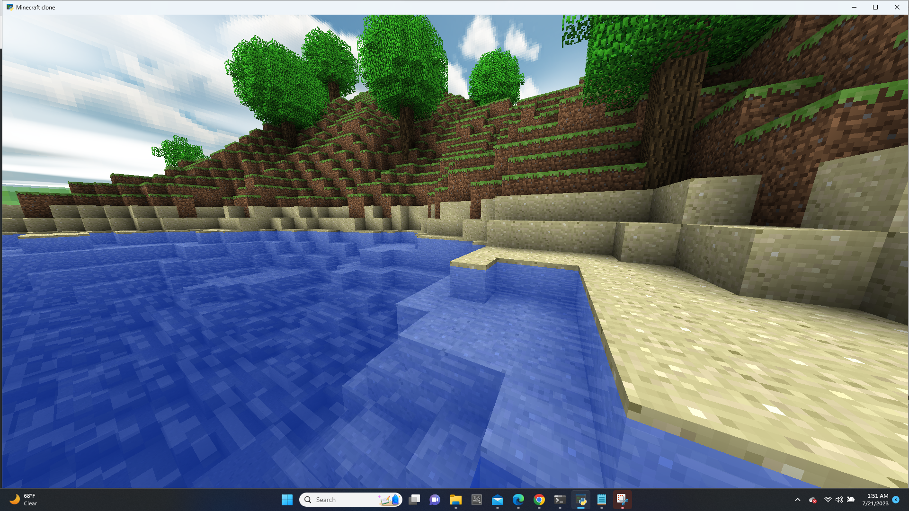

Minecraftclone - README

</br>

Installation:

To run the minecraft game locally, follow these steps:

1. Clone the repository on branch minecraftclone only:

```shell
git clone -b minecraftclone --single-branch https://github.com/WSUCEG-7140/minecraftclone.git
```

2. Navigate in the project directory and type the following command

```console
python3 main.py
```

User manual for playing the game:

W     : Move Forward </br>
S     : Move Backward </br>
A     : Move Left </br>
D     : Move Right </br>
SPACE : Jump </br>
E     : Inventory </br>
F     : Toggle between flying/not Flying  </br>.
Mouse left-click: remove block </br>
Mouse right-click: create block </br>
ESC: release mouse, then close window </br>

Technologies Used

The minecraftclone is built using the following technologies:

- *Python:* A popular interpreted programming language.
- *Pyglet:* A popular python library for building graphic user interfaces.
- *OpenGL:* A library for doing graphics maths.


Contributing

Contributions to the  Minecraftclone are welcome! If you have any ideas, bug fixes, or improvements, feel free to open an issue or submit a pull request. Make sure to follow the existing coding style and commit guidelines.


License

The  minecraftclone is open-source and released under the [MIT License](LICENSE). You are free to use, modify, and distribute the app as per the terms of this license.


Acknowledgments

- The developer, kruslin2 would like to acknowledge the open-source community for their valuable contributions and the creators of the technologies used in this project.


